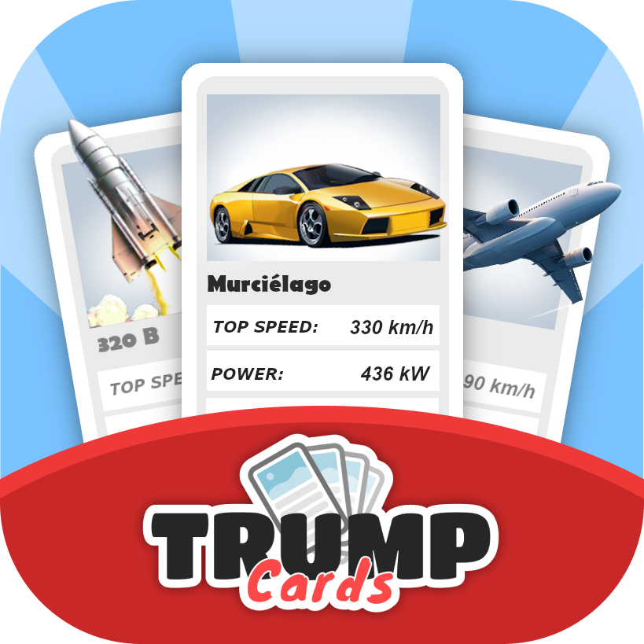
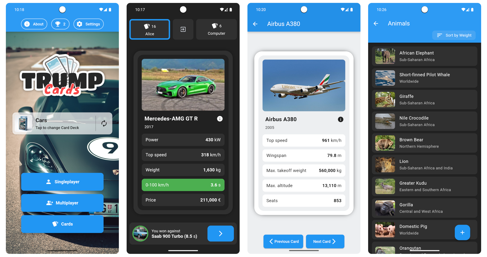

  
  <h1>Trump Cards</h1>
  <h4>
    <a href="https://play.google.com/store/apps/details?id=com.yedesign.card_game" target="_blank">Get it on Google Play</a> • 
    <a href="https://yanexr.github.io/trump-cards" target="_blank">Play on the Web</a>
  </h4>

**Trump Cards** is a a _super-trump_ or _trump-quartet_ card game like _Top Trumps_, where players compare numerical values of various attributes (e.g., speed, power) on their cards. Players take turns selecting a category and comparing the chosen attribute. The player with the highest value wins the round and collects the opponents' cards. The player who has all the cards at the end of the game wins.

## Screenshots

  

## Features

- 9 different card decks (3 on the client and 6 on the server)
- Each card shows a number of attributes, a picture and a more detailed description on the back
- 10 different card design themes to choose from
- Supports different measurement systems (metric, imperial, ...)
- Singleplayer with different difficulty levels
- Online and offline multiplayer
- Card and card deck editor for creating custom cards and card decks
- Supports 12 different languages

## How to add or change card decks

New card decks can be added, or existing ones can be changed by editing the `client/lib/data` directory.

1. To create a new card deck, first create a list of cards of type `List<GameCard>` with a length of at least 30.

2. Then create and add your card deck to the list of card decks in `cardDecks.dart`.

3. Finally, create a new directory (same name as your card deck) in the `client/assets/images/<YourCardDeckName>` directory and add the images of the cards and a background image `background.jpg` to it. Add your new directory to the list of assets in the `client/pubspec.yaml` file.
